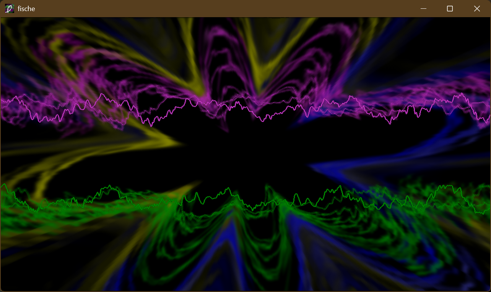
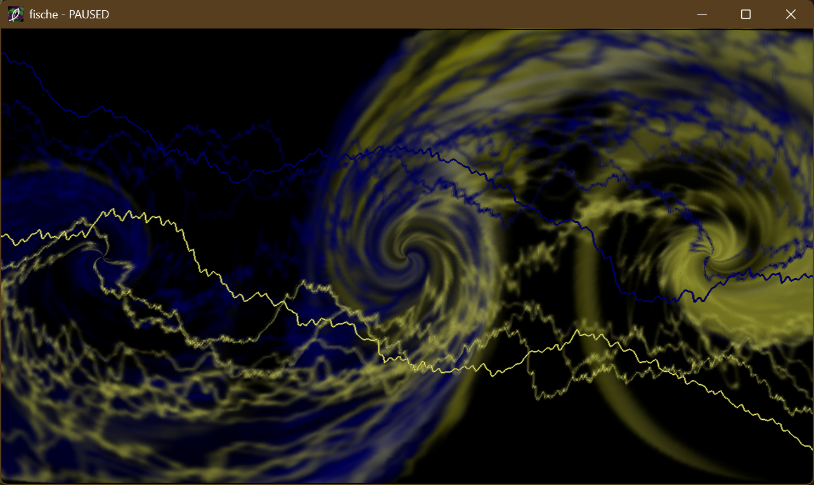
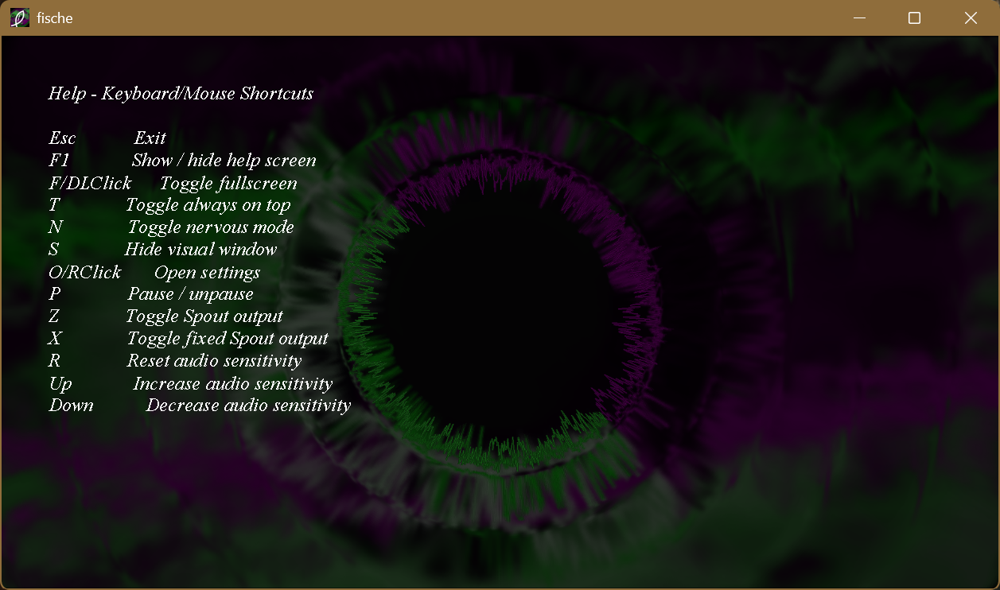
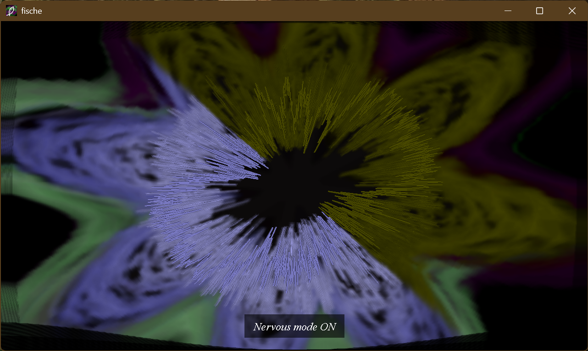
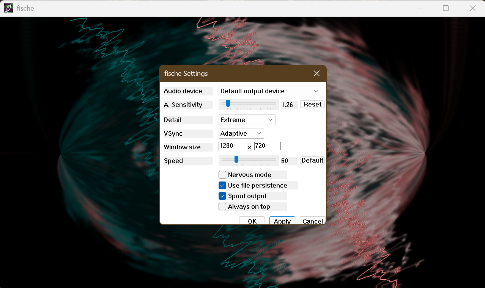
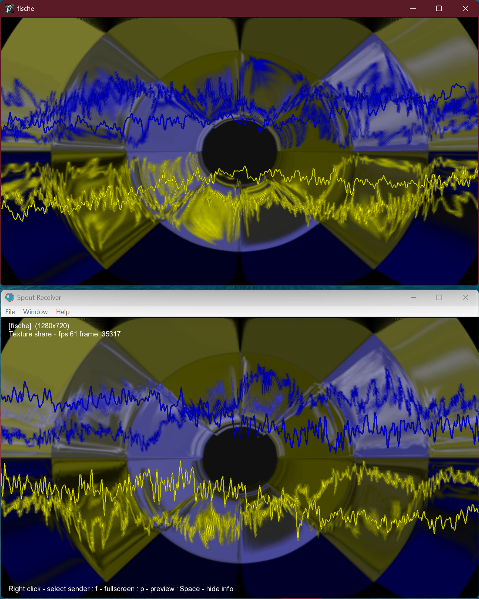

[](https://github.com/OfficialIncubo/fische-windows/actions/workflows/build.yml)
[](https://github.com/OfficialIncubo/fische-windows/releases/latest)
[](https://github.com/OfficialIncubo/fische-windows/releases)
[](https://github.com/OfficialIncubo/fische-windows)
[](https://github.com/OfficialIncubo/fische-windows/blob/main/LICENSE.md)

# fische for Windows

A Windows port of [fische](https://github.com/maysl/fische) — a real-time standalone music visualizer originally built for Linux. This port brings fische to Windows with native WASAPI loopback audio capture, [Spout](https://spout.zeal.co/) texture sharing for sending the visualization to other apps, OpenGL rendering via GLFW, adjustable audio sensitivity, VSync and FPS control, always-on-top, fullscreen, and a native Win32 settings dialog — all packed into a single portable executable.

---

## Screenshots

*fische for Windows — real-time audio visualization*


*Visual paused — title bar shows "fische - PAUSED"*


*F1 help screen with keyboard/mouse shortcuts*


*On-screen display for hotkey feedback*


*Native Win32 settings dialog*


*Spout output received in Spout Receiver at 60 FPS*


---

## Video demos

*fische for Windows Demo*

https://github.com/user-attachments/assets/cb9b4758-1ef1-41ae-8c46-65d9c1dda77a

[Watch/Download for high-quality version](https://github.com/OfficialIncubo/fische-windows/raw/main/demo/fischeWindowsDemo.mp4)

*fische → [NestDrop]((https://nestimmersion.ca/nestdrop.php)) via [Spout]((https://spout.zeal.co/))*

https://github.com/user-attachments/assets/0ec0343a-4ed2-4d37-a467-74acdff5ea09

[Watch/Download for high-quality version](https://github.com/OfficialIncubo/fische-windows/raw/main/demo/fischeWindowstoNestDrop.mp4)

---

## Features

- 🎵 **Real-time audio visualization** — reacts to whatever is playing on your speakers, microphone or any virtual cable;
- 🔊 **WASAPI loopback capture** — captures system audio output directly; supports 44.1 kHz, 48 kHz, 96 kHz, and 192 kHz sample rates
- 🎛️ **ASIO support** — connect any ASIO-compatible audio interface, DJ controller (e.g., [Pioneer DJ](https://www.pioneerdj.com)/[AlphaTheta](https://alphatheta.com), [Denon DJ](https://www.denondj.com), [Numark](https://www.numark.com) etc.) or virtual ASIO driver (e.g. [ASIO4ALL](https://asio4all.org), [FlexASIO](https://github.com/dechamps/FlexASIO)) for low-latency instrument, microphone or direct output from DJ software ([Serato DJ](https://serato.com/dj), [rekordbox](https://rekordbox.com), [VirtualDJ](https://virtualdj.com)) and DAWs; selectable alongside WASAPI devices in the settings dialog
- 🎚️ **Adjustable audio sensitivity** — boost or reduce the audio input level with Up/Down keys or the settings dialog; ranges from 0 to 15.
- 📡 **[Spout]((https://spout.zeal.co/)) output** — share the visualization as a texture with any Spout-compatible app ([OBS](https://obsproject.com) via [Spout Plug-in](https://github.com/Off-World-Live/obs-spout2-plugin), [SpoutCam](https://github.com/leadedge/SpoutCam), [Resolume](https://www.resolume.com), [NestDrop](https://nestimmersion.ca/nestdrop.php), [TouchDesigner](https://derivative.ca) etc.); sent as a DirectX 11 shared texture via Spout interop
- ⚙️ **Settings dialog** — configure audio device, detail level, FPS limit, VSync, Spout and more; all saved to `settings.ini`
- 🖼️ **Fullscreen support** — toggle at any time with `F` or with `Double Left Click`
- 🧠 **Nervous mode** — rapid-animation style toggle
- ⏸️ **Pause / unpause**
- 💾 **Vector file persistence** — optionally cache computed vector fields to `vectors/` for faster startup
- 🎒 **100% Portable** — A bootstrapped .exe with settings UI, settings and vector loading/saving and lots of functionalities

---

## The story

4 years ago (almost the end of August 2022), I've stumbled across FishBMC while playing some tunes on [Kodi](https://kodi.tv) using my phone (the old phone was Huawei P30 lite for me). A few days ago, I've decided to fully port this standalone visualization by the same name ([fische](https://github.com/maysl/fische)) to Windows, first thing I've tried to port it by using [ChatGPT Codex](https://chatgpt.com/codex/), but this one did a very great job on a first try. I've then refined and added some features using [Claude](https://claude.ai) and my own work, idea and inspiration. For me it looks like it's [MilkDrop](https://www.geisswerks.com/milkdrop/)-ish inspired UI in-render + a very much excitement of new additional features, Spout visual sending, functional hotkeys, settings dialog and so on. That's a story.

---

## System Requirements

| Requirement | Minimum |
|-------------|---------|
| OS          | Windows 7 or later |
| GPU         | OpenGL 3.2 Core |
| CPU         | Any 32-bit or 64-bit compatible processor |
| Audio       | Any WASAPI-compatible output device |
| RAM         | 128 MB |
| Spout       | Optional — [Spout](https://spout.zeal.co/) for sending visual renderer |

---

## Running

1. Copy the executable for your PC to any folder you want: `fische-x64.exe` for 64-bit Windows, or `fische-x86.exe` for 32-bit Windows.
2. Double-click it to run.

On the first run, `settings.ini` is created next to the executable with default settings. Audio capture starts automatically using the default output device.

---

## Controls

| Key | Action |
|-----|--------|
| `Esc` | Exit |
| `F1` | Show / hide help screen |
| `F` (or `Double Left Click`) | Toggle fullscreen |
| `T` | Toggle always on top |
| `N` | Toggle nervous mode |
| `O` (or `Right Click`) | Open settings dialog |
| `P` | Pause / unpause |
| `Z` | Toggle Spout output |
| `R` | Reset audio sensitivity |
| `Up` | Increase audio sensitivity |
| `Down` | Decrease audio sensitivity |

---

## Settings

`settings.ini` is created beside the executable on first run:

```ini
[fische]
Audio=
AudioSensitivity=1
Detail=High
Quality=2
FPSLimit=60
NervousMode=false
UseFilePersistence=false
SpoutSenderEnabled=false
VSync=Off
AlwaysOnTop=false
WindowWidth=1280
WindowHeight=720
```

| Key | Type | Description |
|-----|------|-------------|
| `Audio` | string | Friendly name of the audio device; `[ASIO]` prefix for ASIO drivers, empty/no name match = system default output |
| `AudioSensitivity` | 0-15 | Multiplier applied to audio input before visualization; 1 = no change |
| `Detail` | Low / Normal / High / Extreme | Visual detail level (also written as `Quality` 0-3) |
| `FPSLimit` | 0-240 | Target frame rate; 0 = unlimited |
| `NervousMode` | true / false | Rapid animation mode |
| `UseFilePersistence` | true / false | Cache vector fields to `vectors/` folder |
| `SpoutSenderEnabled` | true / false | Enable Spout texture sharing |
| `VSync` | Off / On / Adaptive | VSync mode; Adaptive mode uses `glfwSwapInterval(-1)`, which reduces tearing without hard locking the frame rate |
| `AlwaysOnTop` | true / false | Keep the visual window above all other windows |
| `WindowWidth` / `WindowHeight` | integer | Last window size; restored on next launch |

---

## Build

See [Build Instructions.md](Build%20Instructions.md).

---

## License

GNU General Public License v2.0 or later.

- Original fische engine: © 2013 Marcel Ebmer ([@maysl](https://github.com/maysl)), © 2005–2026 Team Kodi; The Kodi Foundation
- Spout: © Lynn Jarvis ([@leadedge](https://github.com/leadedge)) — BSD-style
- Windows port and integration: see `LICENSE.md`

---

## Credits

| Project | Author |
|---------|--------|
| [fische](https://github.com/maysl/fische) | Marcel Ebmer ([maysl](https://github.com/maysl)) |
| [visualization.fishbmc](https://github.com/xbmc/visualization.fishbmc) ([alternative (OLD)](https://github.com/maysl/fishbmc)) | Team Kodi; The Kodi Foundation |
| [GLFW](https://www.glfw.org/) | Camilla Löwy and contributors |
| [Spout](https://spout.zeal.co) | Lynn Jarvis ([leadedge](https://github.com/leadedge)) |
| [BeatDrop loopback capture](https://github.com/OfficialIncubo/BeatDrop-Music-Visualizer/tree/master/audio) | Matthew van Eerde & Incubo_ |
| [fische GLFW project inspiration/derived from](https://discord.com/channels/737206408482914387/1500210344621113345) | [proconsule](https://github.com/proconsule) |
| [GLAD](https://glad.dav1d.de/) | David Herberth |
| [GLM](https://github.com/g-truc/glm) | G-Truc Creation |

---

## Related Links

- Original fische website (archived): https://web.archive.org/web/20200801073714/http://26elf.at/musicviz/
- Spout: https://spout.zeal.co/
- WASAPI loopback capture by Matthew van Eerde: https://matthewvaneerde.wordpress.com/2008/12/16/sample-wasapi-loopback-capture-record-what-you-hear/
- BeatDrop Music Visualizer: a custom MilkDrop2 standalone visualization for Windows: https://github.com/OfficialIncubo/BeatDrop-Music-Visualizer/

## Star History

[](https://star-history.com/#OfficialIncubo/fische-windows&Date)
